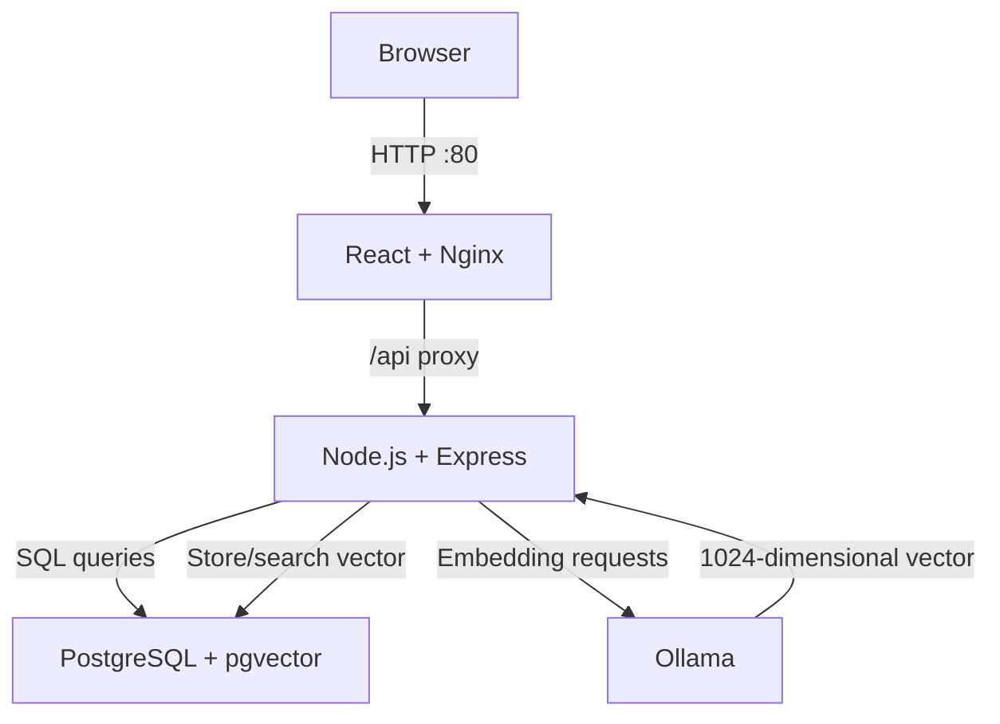
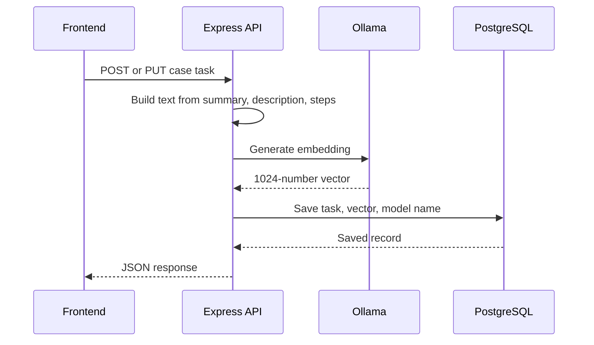
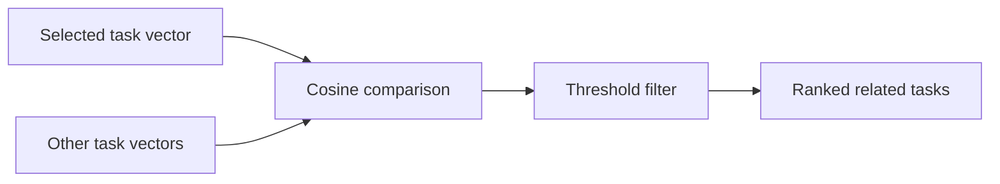
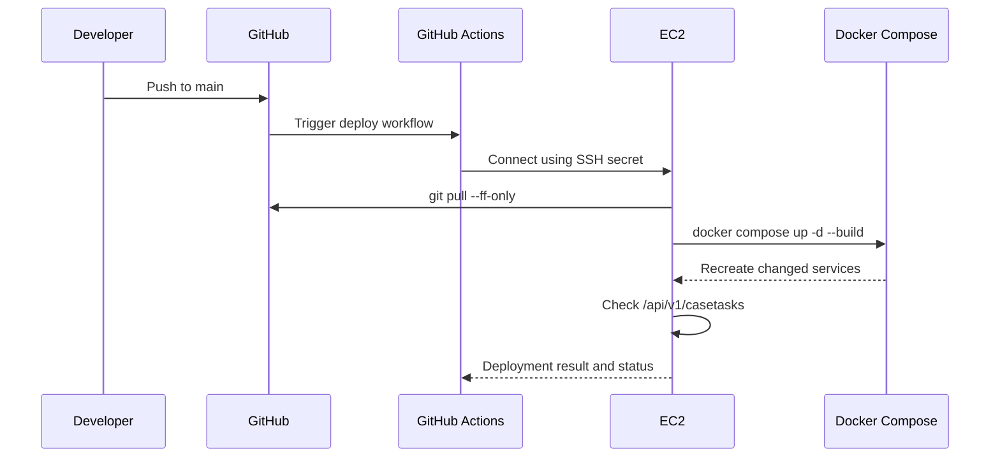

# Semantic Case Task Similarity Application

A full-stack learning project for managing case tasks and finding semantically similar issues. The application converts issue text into embeddings with Ollama, stores those embeddings in PostgreSQL using pgvector, and compares them with cosine similarity.

## What the project does

- Creates, reads, updates, and deletes case tasks.
- Generates a 1024-dimensional embedding for each task.
- Uses the issue summary, description, and reproduction steps as embedding input.
- Regenerates the embedding when relevant task text changes.
- Finds related tasks using pgvector cosine distance.
- Runs the frontend, backend, database, and Ollama as Docker containers.
- Deploys the complete stack to one AWS EC2 instance.
- Automatically redeploys changes pushed to `main` using GitHub Actions.

## Architecture



Nginx serves the production React build and proxies `/api/*` requests to the Compose service `backend:3000`. PostgreSQL and Ollama are accessible only through the internal Docker network.

## Technology stack

| Layer | Technology |
|---|---|
| Frontend | React, Vite |
| Web server | Nginx |
| Backend | Node.js, Express |
| Database | PostgreSQL |
| Vector search | pgvector |
| Embedding runtime | Ollama |
| Embedding model | `qwen3-embedding:0.6b` |
| Embedding dimensions | 1024 |
| Containers | Docker, Docker Compose |
| Hosting | AWS EC2 |
| CI/CD | GitHub Actions |

## Project structure

```text
ollama-embeddings/
├── CRUD_CT_FE/                 # React frontend
│   ├── Dockerfile              # Builds React and serves it with Nginx
│   ├── nginx.conf              # SPA fallback and /api reverse proxy
│   └── vite.config.js
├── CRUD_CT_BE/                 # Express backend
│   ├── Dockerfile
│   └── src/
│       ├── importTasks.js
│       └── generateExistingEmbeddings.js
├── db/
│   └── init.sql                # Extensions and initial database schema
├── .github/workflows/
│   └── deploy.yml              # EC2 deployment workflow
├── compose.yaml
├── .env.example
└── README.md
```

Adjust the paths above if the backend entry files are organized differently in the repository.

## Case-task data

Each task contains fields such as:

- `number`
- `issueSummary`
- `issueDescription`
- `releaseVersion`
- `stepsToReproduce`
- `status`
- `priority`
- `assignedTo`
- `createdBy`
- `createdDate`
- `workNotesList`
- `embedding`
- `embeddingModel`

`work_notes_list` is stored as `JSONB` and checked to ensure it is an array. The generated `id` is the primary key, while `number` is unique and is used in task URLs.

## Embedding flow



The embedding input is built from:

```text
Summary: <issue summary>
Description: <issue description>
Steps: <steps to reproduce>
```

New tasks receive an embedding during `POST`. Relevant task updates regenerate the embedding during `PUT`. Existing records can be backfilled with `generateExistingEmbeddings.js`.

## Similarity search

The related-task endpoint:

1. Fetches the selected task and its embedding.
2. Compares it with embeddings from other tasks.
3. Uses pgvector cosine distance (`<=>`).
4. Converts distance to similarity using `1 - distance`.
5. Excludes the current task.
6. Applies the configured threshold, such as `0.8`.
7. Returns the closest matches in descending similarity order.



## API endpoints

| Method | Endpoint | Purpose |
|---|---|---|
| `GET` | `/api/v1/casetasks` | List tasks |
| `GET` | `/api/v1/casetasks/:number` | Get a task by task number |
| `POST` | `/api/v1/casetasks` | Create a task and its embedding |
| `PUT` | `/api/v1/casetasks/:number` | Update a task and regenerate its embedding |
| `DELETE` | `/api/v1/casetasks/:number` | Delete a task |
| `GET` | `/api/v1/casetasks/:number/similar` | Find semantically similar tasks |
| `GET` | `/api/v1/health` | Verify the deployed backend version/status |

## Environment configuration

Create `.env` beside `compose.yaml`:

```env
DB_PASSWORD=replace_with_a_secure_password
FRONTEND_PORT=8080
```

For EC2, use:

```env
DB_PASSWORD=replace_with_a_secure_password
FRONTEND_PORT=80
```

Keep `.env` ignored by Git:

```gitignore
.env
.env.*
!.env.example
```

Commit only `.env.example` with placeholder values. If a real secret has ever been pushed, rotate it because deleting it from the latest commit does not remove it from Git history.

## Run locally with Docker Compose

Requirements:

- Docker Desktop
- Docker Compose
- Enough memory for PostgreSQL, the backend, frontend, and Ollama

Start the stack:

```bash
docker compose up -d --build
docker compose ps
```

The local frontend is available at:

```text
http://localhost:8080
```

Pull the embedding model once:

```bash
docker compose exec ollama ollama pull qwen3-embedding:0.6b
```

Import sample tasks when the database is empty:

```bash
docker compose exec backend node src/importTasks.js
```

Generate embeddings for existing tasks:

```bash
docker compose exec backend node src/generateExistingEmbeddings.js
```

## Verification

Check record and embedding counts:

```bash
docker compose exec db psql \
  -U case_app \
  -d case_tasks_db \
  -c "SELECT COUNT(*) AS total,
             COUNT(embedding) AS with_embedding,
             COUNT(*) - COUNT(embedding) AS missing_embedding
      FROM case_tasks;"
```

Check vector dimensions and model:

```bash
docker compose exec db psql \
  -U case_app \
  -d case_tasks_db \
  -c "SELECT number,
             vector_dims(embedding) AS dimensions,
             embedding_model
      FROM case_tasks
      ORDER BY number;"
```

Test the complete Nginx-to-backend route:

```bash
curl http://localhost:8080/api/v1/casetasks
curl http://localhost:8080/api/v1/casetasks/CSTSK2001
curl http://localhost:8080/api/v1/casetasks/CSTSK2001/similar
```

## Docker responsibilities

Each Dockerfile describes how to build one application image:

- Frontend Dockerfile: builds the Vite application and copies `dist` into Nginx.
- Backend Dockerfile: installs dependencies and starts the Express application.

`compose.yaml` coordinates all services, their environment variables, internal DNS names, dependencies, ports, networks, and persistent volumes.

Inside containers, service names replace `localhost`:

| Client | Target | Correct hostname |
|---|---|---|
| Backend | PostgreSQL | `db:5432` |
| Backend | Ollama | `http://ollama:11434` |
| Nginx | Backend | `http://backend:3000` |

`localhost` inside a container refers to that same container, not another Compose service.

## AWS EC2 deployment

The complete stack runs on one EC2 instance for learning purposes.

Recommended minimum for the local Ollama model:

- `t3.medium`: 2 vCPUs and 4 GiB RAM
- A larger instance may be needed for higher load or larger models

Only these ports need to be publicly accessible:

| Port | Use | Suggested source |
|---:|---|---|
| 22 | SSH | Your IP only |
| 80 | HTTP | `0.0.0.0/0` |
| 443 | HTTPS, when configured | `0.0.0.0/0` |

Do not publicly expose PostgreSQL `5432`, backend `3000`, or Ollama `11434`.

After cloning the repository on EC2:

```bash
cd ~/ollama-embeddings
nano .env
chmod 600 .env
docker compose up -d --build
```

Then pull the model and initialize data as described above. Docker named volumes preserve PostgreSQL data and Ollama models across ordinary container recreations. Avoid `docker compose down -v` unless intentionally deleting persistent data.

Stopping and restarting EC2 can change its public IPv4 address. Update the SSH configuration and the `EC2_HOST` GitHub secret, or attach an Elastic IP.

## CI/CD pipeline



The workflow is triggered by relevant changes to the frontend, backend, database setup, Compose file, environment example, or workflow itself. It connects to EC2, pulls the latest commit, builds the Compose services, starts them, and retries an HTTP health check before declaring success.

Required GitHub Actions secrets:

```text
EC2_HOST
EC2_USER
EC2_SSH_KEY
```

The real database password is not stored in GitHub for this setup; it remains in `~/ollama-embeddings/.env` on EC2.

## Frontend production debugging

Vite production builds bundle the original React files. To debug original source files in Chrome, enable source maps:

```js
build: {
  sourcemap: true
}
```

The Docker build currently forces source-map generation with:

```dockerfile
RUN npm run build -- --sourcemap
```

Source maps help learning and debugging but expose readable frontend source to visitors. Disable them for a stricter production build.

## Common issues solved

### `ECONNREFUSED 127.0.0.1:5432`

The backend container was trying to reach PostgreSQL inside itself. Use `DB_HOST=db`.

### Ollama `fetch failed`

Configure the Node Ollama client with `http://ollama:11434` and make sure the model exists inside the Ollama container.

### Nginx `host not found in upstream "backend"`

The frontend was running as a standalone container while its Nginx configuration expected the Compose service `backend`. Deploy the full stack with Compose.

### PostgreSQL requires a superuser password

Create the ignored `.env` file directly on the machine running Compose and set a non-empty `DB_PASSWORD`.

### EC2 UI loads but contains no records

The EC2 PostgreSQL volume is separate from the local database. Import the initial data and generate embeddings on EC2.

### SSH became slow

The original `t3.micro` had insufficient memory for the entire stack and Ollama. The instance was resized to a type with more memory.

## Security notes

- Never commit `.env`, private SSH keys, or real passwords.
- Restrict SSH to your current public IP.
- Keep database, backend, and Ollama ports private.
- Add HTTPS before using the application beyond learning/testing.
- Use a managed secrets service for a production system.
- Back up the PostgreSQL volume before destructive operations.
- Do not use `POSTGRES_HOST_AUTH_METHOD=trust` for deployment.

## Current status

- Frontend and API are reachable through the EC2 public address.
- Nginx proxies relative `/api` requests to the backend.
- PostgreSQL with pgvector is healthy.
- Ollama runs in the Compose network.
- Existing records can be imported and embedded.
- New and updated records generate embeddings.
- Similar tasks are returned using cosine similarity.
- Frontend and backend changes are deployed from GitHub Actions.
- A backend health/version endpoint can verify that backend changes reached EC2.

## Possible next improvements

- Attach an Elastic IP and domain name.
- Add HTTPS with a certificate.
- Add API authentication and authorization.
- Add request validation with a schema library.
- Add database migrations instead of relying only on initialization SQL.
- Add automated API and similarity tests.
- Add PostgreSQL backups.
- Add structured logs and monitoring.
- Create a pgvector index when the dataset grows.
- Move PostgreSQL to RDS and embeddings to a managed service for a production architecture.

